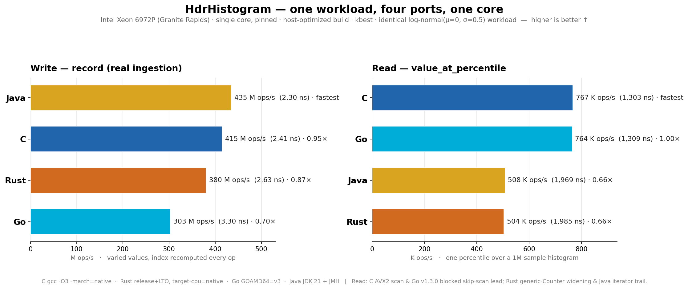
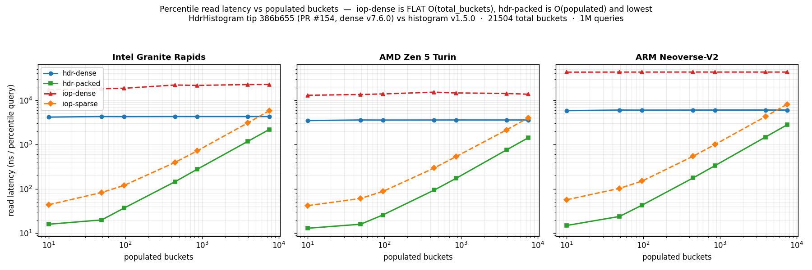

# hdr-agent-workspace

Performance-optimization workspace for [HdrHistogram_c](https://github.com/HdrHistogram/HdrHistogram_c) —
the C implementation of HdrHistogram (high-dynamic-range histograms).

Goal: push the `hdr_record_value` write path and the `hdr_value_at_percentile` read path
beyond their current baseline through profiled, evidence-based changes — every one
pre-cleared for upstream merge by an **adversarial review** modeled on the project
maintainer's real review M.O. Every experiment is logged; failures are as valuable as wins.

> **Minimum model: Opus 4.8** for every agent in every phase.
> **Public repo:** no secrets, credentials, tokens, private IPs, customer names, Slack, or
> ticket references anywhere in this tree.

---

## Cross-language comparison — C / Go / Rust / Java

The **same** log-normal workload run through each HdrHistogram port on one core of an
**Intel Xeon 6972P** (Granite Rapids), host-optimized build, kbest. Higher is better.
Full methodology + runnable harnesses: [`experiments/CROSS-LANG/`](experiments/CROSS-LANG/RESULTS.md).



| Operation | C | Go | Rust | Java |
|-----------|----:|----:|----:|----:|
| **write** · varied (real ingestion) | 415 M/s | 303 M/s | 380 M/s | **435 M/s** |
| **read** · single percentile | **767 K/s** | 764 K/s | 508 K/s | 504 K/s |

**Reads** split two ways: C's AVX2 scan and Go v1.3.0's blocked skip-scan lead (~1,300 ns);
Rust's generic `Counter` widening and Java's iterator-based percentile trail (~1,980 ns).
**Writes** land within ~1.4× (Java ≈ C > Rust > Go on real, varied ingestion). The naive
*constant*-value write (C/Java collapse to 1.93 ns) is a JIT/compiler hoisting artifact, not
real ingestion — see [RESULTS.md](experiments/CROSS-LANG/RESULTS.md). Batch APIs are omitted:
Java has none, so a fair single-call comparison isn't possible.

---

## Upstream PRs — cross-port status (last updated 2026-08-26)

Optimizations proposed to all three ports from this workspace. Every change is
benchmarked (same-session A/B) and byte-identical-verified before it's opened.

**Tally (2026-08-26):** **C** — 3 merged (#134/#135/#136), 11 open (5 perf #137–#141 · 5 dense-hardening #145–#149 · packed #150), 1 closed. **Go** — **16 merged (#57–#74)**, 1 open (packed #75). **Rust** — 2 merged (#138, #140), 1 open (packed #154), 2 closed (#139, #153).

### C — [HdrHistogram/HdrHistogram_c](https://github.com/HdrHistogram/HdrHistogram_c) (fork `fcostaoliveira/HdrHistogram_c`)
| PR | State | What |
|----|-------|------|
| [#134](https://github.com/HdrHistogram/HdrHistogram_c/pull/134) | **MERGED** | AVX2 vectorized prefix-sum in the percentile scan (read) |
| [#135](https://github.com/HdrHistogram/HdrHistogram_c/pull/135) | **MERGED** | bypass `normalize_index` on the record hot path when offset==0 (write) |
| [#136](https://github.com/HdrHistogram/HdrHistogram_c/pull/136) | **MERGED** | single unsigned bounds check on the record path (write) |
| [#133](https://github.com/HdrHistogram/HdrHistogram_c/pull/133) | re-applied | guarded stores in `update_min_max` (maintainer's style variant) |
| [#138](https://github.com/HdrHistogram/HdrHistogram_c/pull/138) | **OPEN** ✅ CI green | widen AVX2 percentile scan 4→16/iter — read +137%/+144% |
| [#139](https://github.com/HdrHistogram/HdrHistogram_c/pull/139) | **DRAFT** (stacked on #138) | prefetch `counts[]` — read +8% (2 µarchs) |
| [#140](https://github.com/HdrHistogram/HdrHistogram_c/pull/140) | **OPEN** ✅ CI green | single-pass `hdr_value_at_percentiles` (+ offset test) — batch +599% |
| [#141](https://github.com/HdrHistogram/HdrHistogram_c/pull/141) | **OPEN** (stacked on #140) | blocked skip-scan for the batch fast path — batch **+134%** on top of #140 (2.34×) |
| [#137](https://github.com/HdrHistogram/HdrHistogram_c/pull/137) | **OPEN** ⚠️ conflicts | portable block-sum (drops AVX2) + single-pass batch — overlaps #138/#139/#140 |

Plus the packed review surfaced **5 dense-hardening fixes** (all **OPEN**):
[#145](https://github.com/HdrHistogram/HdrHistogram_c/pull/145) bucket-config shift overflow ·
[#146](https://github.com/HdrHistogram/HdrHistogram_c/pull/146) V1/V2 decode heap OOB ·
[#147](https://github.com/HdrHistogram/HdrHistogram_c/pull/147) mean/count OOB ·
[#148](https://github.com/HdrHistogram/HdrHistogram_c/pull/148) top-bucket overflow ·
[#149](https://github.com/HdrHistogram/HdrHistogram_c/pull/149) iterator overflow — and the sparse
variant [**#150**](https://github.com/HdrHistogram/HdrHistogram_c/pull/150) (see [Sparse / packed histogram](#sparse--packed-histogram--the-memory-feature-2026-08)).

### Go — [HdrHistogram/hdrhistogram-go](https://github.com/HdrHistogram/hdrhistogram-go) (fork `fcostaoliveira/hdrhistogram-go`)
| PR | State | What |
|----|-------|------|
| [#57](https://github.com/HdrHistogram/hdrhistogram-go/pull/57) | ✅ **MERGED** `22a1b78` | flat `counts[]` scan in `ValueAtPercentile` — read +133% |
| [#58](https://github.com/HdrHistogram/hdrhistogram-go/pull/58) | ✅ **MERGED** `bbda977` | flat `counts[]` scan in `ValueAtPercentiles` (batch) — +303% |
| [#59](https://github.com/HdrHistogram/hdrhistogram-go/pull/59) | ✅ **MERGED** `37ca617` | single unsigned bounds check in `RecordValues` (write) — +7% |
| [#62](https://github.com/HdrHistogram/hdrhistogram-go/pull/62) | ✅ **MERGED** `ebe2303` | `range` over `counts[]` in the scans to elide bounds checks — read **+72%** |
| [#63](https://github.com/HdrHistogram/hdrhistogram-go/pull/63) | ✅ **MERGED** `6b5dd0d` | `ValueAtPercentilesSlice` — ordered `[]int64` batch (no map alloc) — batch **+42.5%** |
| [#64](https://github.com/HdrHistogram/hdrhistogram-go/pull/64) | ✅ **MERGED** `b00adb1` | blocked prefix-sum skip-scan (read **+50%**) + write bounds-check elision (**+5.1%**) + `Import` length hardening |
| [#65](https://github.com/HdrHistogram/hdrhistogram-go/pull/65) | ✅ **MERGED** | fix 6 untrusted-input panics in `Decode`/log-reader + native Go fuzzers + ClusterFuzzLite/CI (repo had zero fuzzing) |
| [#66](https://github.com/HdrHistogram/hdrhistogram-go/pull/66) | ✅ **MERGED** | `Mean` int64 overflow · `normalizingIndexOffset` C/Java wire bug · `BaseTime` log-casing · `StartTime` UTC (closes #61) |
| [#67](https://github.com/HdrHistogram/hdrhistogram-go/pull/67) | ✅ **MERGED** | percentile edge contracts — empty histogram (closes #60), negative clamp, map phantom key |
| [#68](https://github.com/HdrHistogram/hdrhistogram-go/pull/68) | ✅ **MERGED** | percentile `max(count,1)` — 0th percentile == recorded min across all 3 APIs; addressed @dkropachev negative-clamp review + added cross-API test |
| [#69](https://github.com/HdrHistogram/hdrhistogram-go/pull/69) | ✅ **MERGED** | `Reset` clears tag/start/end time, not just counts |
| [#70](https://github.com/HdrHistogram/hdrhistogram-go/pull/70) | ✅ **MERGED** | bench: remove dead fill loop that panics for b.N>1e6 |
| [#71](https://github.com/HdrHistogram/hdrhistogram-go/pull/71) | ✅ **MERGED** | test-only coverage boost 85.9%→87.8% (zigzag ladder, overflow guard, merge/corrected edges) |
| [#72](https://github.com/HdrHistogram/hdrhistogram-go/pull/72) | ✅ **MERGED** | log reader: decode final interval line lacking a trailing newline (was silently dropped) |
| [#73](https://github.com/HdrHistogram/hdrhistogram-go/pull/73) | ✅ **MERGED** | test-only: pin golden values for the logV2 reader fixtures (was err==nil/NotNil only) |
| [#74](https://github.com/HdrHistogram/hdrhistogram-go/pull/74) | ✅ **MERGED** | `RecordValues` rejects a negative count (was silently driving counts/TotalCount negative); write path unchanged at ~3.2 ns/op |
| [#75](https://github.com/HdrHistogram/hdrhistogram-go/pull/75) | **OPEN** ✅ CI 17/17 | **PackedHistogram** — sparse memory variant ([details](#sparse--packed-histogram--the-memory-feature-2026-08)) |

### Rust — [HdrHistogram/HdrHistogram_rust](https://github.com/HdrHistogram/HdrHistogram_rust) (fork `fcostaoliveira/HdrHistogram_rust`)
| PR | State | What |
|----|-------|------|
| [#138](https://github.com/HdrHistogram/HdrHistogram_rust/pull/138) | ✅ **MERGED** | `value_at_quantiles`/`value_at_percentiles` single-pass batch API — +616% |
| [#139](https://github.com/HdrHistogram/HdrHistogram_rust/pull/139) | ⛔ **CLOSED** — superseded by #140 | iterate `counts[]` to elide bounds checks — read +5% (subsumed) |
| [#140](https://github.com/HdrHistogram/HdrHistogram_rust/pull/140) | ✅ **MERGED** | chunked skip-scan in `value_at_quantile` — read **+63%**, batch **+65%** (supersedes #139) |
| [#153](https://github.com/HdrHistogram/HdrHistogram_rust/pull/153) | ⛔ **CLOSED** — superseded by #154 | PackedHistogram on a stale fork base; reopened clean on `main` |
| [#154](https://github.com/HdrHistogram/HdrHistogram_rust/pull/154) | **OPEN** ✅ CI 17/17 | **PackedHistogram** — sparse memory variant ([details](#sparse--packed-histogram--the-memory-feature-2026-08)) |

**Cross-port race + charts:** [`experiments/RACE.md`](experiments/RACE.md). Adversarial PR reviews
(3 reusable skills — `review-hdrhistogram`, `hdr-reviewer-go`, `hdr-reviewer-rust`) caught 2 real
Go bugs pre-merge; see [`experiments/GO-PR-REVIEW-2026-07-02.md`](experiments/GO-PR-REVIEW-2026-07-02.md).
Full PR lineage: [`.workspace-memory/hdr-upstream-prs.md`](.workspace-memory/hdr-upstream-prs.md).

---

## Sparse / packed histogram — the memory feature (2026-08)

Dense HdrHistogram commits its full `counts[]` array up front (**~184 KB/histogram** at the
default latency config), regardless of how many buckets are ever populated. For the **many
sparsely-populated histograms** shape (per-endpoint / per-tenant / per-command / per-connection),
that footprint dominates the heap. Java has had a `PackedHistogram` for this for years; C, Go, and
Rust didn't — so this workspace added one to each, **byte-identical on the wire**.

| Port | PR | Memory win | Read path (sparse) | Verification | CI |
|------|----|-----------|--------------------|--------------|-----|
| **C** | [#150](https://github.com/HdrHistogram/HdrHistogram_c/pull/150) | 36×–1309× | blocked scan | 100% reachable lines · 3-mode libFuzzer · ASan/UBSan | — |
| **Go** | [#75](https://github.com/HdrHistogram/hdrhistogram-go/pull/75) | 36×–1308× | **1.3–2.5× faster** than dense | 100% reachable · differential + hostile fuzz · `-race` | ✅ 17/17 |
| **Rust** | [#154](https://github.com/HdrHistogram/HdrHistogram_rust/pull/154) | up to 2355× | width-specialized blocked scan | 98.7% lines / 100% reachable · 2 fuzzers · clippy | ✅ 17/17 |

**Design (all three):** a sorted virtual-index vector + **adaptive 1/2/4/8-byte counts**, reusing
the dense bucket geometry; the standard **V2 (compressed) wire format is byte-identical** to the
dense encoder, so a packed histogram interoperates with every existing reader — no migration. It is
a *memory* feature (higher per-record cost), for the long tail of mostly-idle histograms.

Concretely: **100 per-endpoint histograms ≈ 18 MB → 14 KB**; Redis's per-command latency tracking
(~407 command histograms at `hdr_init(1, 1e9, 2)`) ≈ **9.6 MB → ~0.1–0.3 MB** (~30–100×).

---

## Competitor — [`iopsystems/histogram`](https://github.com/iopsystems/histogram) (Rust)

The closest alternative in this space (crate `histogram`, ~by the ex-Twitter Rezolus team; keyword
`hdrhistogram`). Same quantized-bucket idea, but a different sparse model. 4-way harness:
[`experiments/iop-vs-hdr/`](experiments/iop-vs-hdr/) (`run.sh`).

| Impl | Kind | Per-entry (sparse) | Dense footprint | Records sparsely? |
|------|------|--------------------|-----------------|-------------------|
| `hdr-dense` (`Histogram<u64>`) | dense `Vec<i64>` | — | `counts_len × 8` (committed) | n/a |
| **`hdr-packed`** (this repo) | **live sparse** | **adaptive 1–8 B** + 4 B idx (**5 B @ width 1**) | — | **yes, from the first sample** |
| `iop-dense` (`Histogram`) | dense `Box<[u64]>` | — | `total_buckets × 8` (committed) | n/a |
| `iop-sparse` (`SparseHistogram`) | **read-only snapshot** | 8 B `u64` + 4 B idx (**12 B**; 8 B for the `u32` variant) | — | **no — built from a dense histogram** |

**The key difference:** iop's `SparseHistogram` is a *columnar snapshot* with **no write path** — you
record into a dense `Histogram` (paying the full committed array) and convert with
`SparseHistogram::from(&dense)`, so it only saves memory *at rest / for serialization*.
`hdr-packed` records **sparsely live** and never materializes the dense array — sparse *while
recording* and at rest. It's also denser per entry (adaptive 1–8 B counts vs iop's fixed 8 B),
so at typical low counts a packed entry is ~1.6–2.4× smaller than an iop `SparseHistogram` entry.

**Measured** on three AWS instances (2026-08-26), `histogram` v1.5.0 vs HDR tip `386b655`
(PR #154, dense crate v7.6.0). Sparse latency-like workload: 4 M writes, 1 M percentile
queries, 1605 populated of 21504 buckets. Full diary: [`experiments/iop-vs-hdr/JOURNAL.md`](experiments/iop-vs-hdr/JOURNAL.md).

**Read latency — ns/query (lower is better):**

| impl | Intel GNR | AMD Zen 5 | ARM N-V2 |
|------|--:|--:|--:|
| `hdr-dense`  |   380 |  316 |    512 |
| `hdr-packed` |   408 |  299 |    597 |
| `iop-dense`  | 10602 | 8840 | 28955 |
| `iop-sparse` |  1238 |  936 |  1645 |

**Write latency — ns/op:** `hdr-dense` 1.8–4.0 · `hdr-packed` 29.9–52.7 · `iop-dense`
0.3–1.0 · `iop-sparse` no live write path (snapshot of a dense histogram).

**Memory (sparse workload, identical on every host):** `hdr-dense` 168 KB · **`hdr-packed`
11.13 KB** · `iop-dense` 168 KB · `iop-sparse` 18.81 KB.

**What the numbers say:**
- **`iop-dense` trades read for write to an extreme:** fastest write (~0.3–1 ns) but its
  `percentile()` costs **8.8–29 µs** — 28× (x86) to **57× (ARM)** slower than `hdr-dense`
  reads, at identical bucket count. The ARM amplification points at branchy scalar code.
- **`hdr-packed` strictly beats `iop-sparse`** on every comparable axis: **2.7–3.1× faster
  reads**, **1.7× smaller**, and it records *live* (iop-sparse can't).
- **`hdr-packed` gives a 15× memory cut (168→11 KB) at read parity with dense** (±7%; on
  Zen 5 it's actually *faster* than dense), paying a ~30–53 ns writer tax — the exact
  many-sparse-histograms trade it targets.

**Why iop-dense reads are slow — root cause (perf + source, `histogram-1.5.0/src/standard.rs`):**
its `percentile()` does **two full O(total_buckets) rescans per call** (total-count sum at
`:208`, min/max scan at `:221`) **plus a `Vec` and a `BTreeMap` heap allocation every query**.
HdrHistogram maintains `total_count` incrementally and does one cheap cumulative walk with no
allocation. A populated-bucket sweep (`src/bin/sweep.rs`) makes the complexity classes visible:



- **`iop-dense` read is FLAT** vs populated (O(total_buckets)) — Intel ~18–23 µs, AMD ~13–15 µs,
  ARM ~43 µs — *never* cheap, even for a near-empty histogram.
- **`hdr-dense` read is also flat but 4–7× tighter.** **`hdr-packed` and `iop-sparse` are
  O(populated)**; `hdr-packed` is the lowest curve on every arch and only crosses `hdr-dense`
  past ~68–87 % full.

**Fairness — iop's best case (batched):** a monitoring snapshot wants a *set* {p50,p99,p99.9},
and iop's batched `percentiles(&[…])` amortizes the two rescans + the alloc across the set
(~2.4–2.9×). Even so, per-snapshot (`src/bin/batched.rs`): **iop-dense batched stays 10× (x86)
to 19× (ARM) slower than hdr-dense**, and **iop-sparse batched still trails hdr-packed**
(e.g. AMD 1085 vs 1006 ns). HDR needs no batched variant — with no per-call rescan or
allocation, three singles cost the same as a batch would.

Reproduce via `experiments/iop-vs-hdr/run.sh` on any host.

---

## Who depends on these ports (downstream consumers)

Verified against each project's vendored `deps/`, `go.mod`, or `Cargo.toml` (primary sources;
unverifiable leads deliberately excluded). This is *why* each port is worth optimizing.

**C — [HdrHistogram_c](https://github.com/HdrHistogram/HdrHistogram_c)** (embedded/vendored directly):
- **Node.js core** — `deps/histogram/`, backs the `perf_hooks` Histogram API + `monitorEventLoopDelay()`.
- **Redis** (and forks **Valkey**, **KeyDB**) — `deps/hdr_histogram/`, per-command latency (`latency-tracking` / `LATENCY`).
- **wrk2** — Gil Tene's constant-throughput HTTP load tester. Also packaged on Conan Center / vcpkg.

**Go — [hdrhistogram-go](https://github.com/HdrHistogram/hdrhistogram-go)** (direct `go.mod` deps):
- Databases / platforms: **CockroachDB**, **Pebble**, **Jaeger** (CNCF), **Dgraph**, **Teleport**, **Dolt**.
- Benchmark tooling: PingCAP **go-ycsb**, ScyllaDB **scylla-bench**, Timescale **TSBS**, **redis-benchmark-go**, **NATS** latency-tests.

**Rust — [`hdrhistogram` crate](https://crates.io/crates/hdrhistogram)** (~108M downloads; direct `Cargo.toml` deps):
- **tokio-console**, **AWS Mountpoint for S3** / AWS SDK for Rust, **Meta** (Hack compiler `hackc`, Sapling/EdenFS), DataDog **glommio**, TiKV **raft-engine**, Jon Gjengset's **tracing-timing**.
- Rust load-testers: **rewrk**, **drill**, **mqttwrk**, **aquatic**, **aeron-rs**.

> Note: vegeta, k6, InfluxDB, and Nomad/Consul reimplement histograms natively and are **not**
> consumers; the JS (`HdrHistogramJS`) and Python (`HdrHistogram_py`) "ports" are independent
> reimplementations (AssemblyScript/Java lineage), **not** wrappers of `HdrHistogram_c`.

---

## Optimization Pipeline

Population-based selection AND implementation, inspired by AutoKernel (arXiv:2603.21331),
extended with an adversarial upstream-merge review gate.

```
PROFILE (write|read) → classify bottleneck → pick tier from program.md
        │
        ▼
  SELECTION — 3 proposers (opus-a/b/c) → chair picks winning hypothesis
        │
        ▼
  IMPLEMENTATION — 3 variants in parallel → each git-applied, ctest'd, benched → best wins
        │
        ▼
  MULTI-STAGE VERIFY — ctest → ASan/UBSan → fuzz (codec/layout)
        │
        ▼
  STEP 1 BENCHMARK (write+read, gcc+clang, same-session)
        │
        ▼
  STEP 2 PROFILE (classify new bottleneck)
        │
        ▼
  ADVERSARIAL REVIEW (review-hdrhistogram) → must be MERGE-READY to PR
        │
   ┌────┴────┐
 ACCEPT    REJECT
 commit    git checkout
 in submod  + Known Non-Starters
        │
   log to EXPERIMENTS.md + token-ledger.tsv
```

Two-step validation is mandatory before accepting any change:

| Step | Tool | Signal |
|------|------|--------|
| 1 — Benchmark | `hdr_histogram_perf` / `hdr_percentile_bench` | ops/sec (write), throughput (read) |
| 2 — Profile | `perf record -g` + `perf report` | hot symbols, % CPU, IPC, branch/cache miss |

Plus: an adversarial review (`.claude/skills/review-hdrhistogram.md`) gates every upstream PR.

---

## Workspace Layout

```
HdrHistogram_c/                 submodule — fork fcostaoliveira/HdrHistogram_c (upstream remote = HdrHistogram/…) — FOCUS
  src/hdr_histogram.c           primary target — record/value/percentile hot paths
HdrHistogram_rust/              submodule — fork fcostaoliveira/HdrHistogram_rust (cross-port reference)
hdrhistogram-go/                submodule — upstream HdrHistogram/hdrhistogram-go (cross-port reference)
  include/hdr/hdr_histogram.h   public struct + API (struct-layout changes)
  test/hdr_histogram_perf.c     immutable WRITE-path driver
  test/hdr_percentile_bench.c   immutable READ-path microbench
experiments/
  EXPERIMENTS.md                append-only log
  SUMMARY.md                    status table (keep README counts in sync)
  TEMPLATE.md                   copy for new entries
  token-ledger.tsv              machine-readable token cost per agent per phase
  EXP-NNN/                      one folder per experiment (bench-results / profile-results / proposals / variants)
scripts/
  build-bench.sh                configure + build perf/bench targets (COMPILER=gcc|clang)
  run-bench.sh                  run write + read drivers, save timestamped output
  run-profile.sh                perf record + report (DRIVER=write|read)
  select.sh                     selection phase: 3 proposers + chair (parallel, Opus 4.8)
  implement.sh                  implementation phase: 3 variants + best-wins (parallel, Opus 4.8)
  agent-run.sh                  agent-agnostic shim (AGENT=claude|codex|aider)
  llm-call.py                   Anthropic API caller + token ledger
.claude/
  CLAUDE.md                     agent instructions (workflow, rules, correctness invariants)
  program.md                    tiered optimization playbook (Tiers 1–6, bottleneck table)
  settings.json                 model = opus 4.8, tool permissions
  skills/
    optimize.md                 full loop orchestration
    select.md / chair.md        proposer + chair prompts
    implement.md                implementer prompt
    bench.md / profile.md       benchmark + profiling skills
    review-hdrhistogram.md      ADVERSARIAL upstream-merge review (maintainer M.O.)
.workspace-memory/
  MEMORY.md + entries           persistent, sanitized, agent-backend-agnostic
AGENTS.md                       conventions for agent loops
```

---

## Quick Start

```bash
git clone --recurse-submodules git@github.com:redis-performance/hdr-agent-workspace.git
cd hdr-agent-workspace

# Build the benchmark + perf drivers
COMPILER=gcc scripts/build-bench.sh

# Baseline (write + read)
EXP=EXP-001 scripts/run-bench.sh

# Profile the write path
scripts/run-profile.sh

# Edit HdrHistogram_c/src/hdr_histogram.c, then re-build / re-bench / re-profile,
# run the adversarial review, and commit in the submodule on accept.
```

---

## Experiments

All logged in [`experiments/EXPERIMENTS.md`](experiments/EXPERIMENTS.md);
[`experiments/SUMMARY.md`](experiments/SUMMARY.md) is the status source of truth.

| Status | Count |
|--------|------:|
| Accepted | 4 |
| Rejected | 1 |
| Parked | 0 |
| In Progress | 0 |

- **EXP-002** (ACCEPT) — widen the AVX2 percentile scan 4→16 int64/iter with a vector accumulator:
  read path **+137% (gcc) / +144% (clang)** on Cascade Lake, percentile results bit-identical.
  Upstreamed as **[PR #138](https://github.com/HdrHistogram/HdrHistogram_c/pull/138)** (body offers to re-target if the maintainer prefers #137's portable path).
- **EXP-003→004** (ACCEPT) — software prefetch of `counts[]` ahead in the widened scan. Parked after
  Cascade Lake (gcc +8%, clang flat), then validated on a 2nd µarch (Granite Rapids: **gcc +7.7% /
  clang +5.7%**) — portable across two µarchs/compilers, clang never regresses. Branch
  `perf/avx2-scan-prefetch`; follow-up **[PR #139](https://github.com/HdrHistogram/HdrHistogram_c/pull/139)** (stacked on #138).
- **EXP-007** (ACCEPT) — blocked skip-scan in the `hdr_value_at_percentiles` batch fast path: sum 8
  counters/block (autovectorizes to AVX2/NEON, no intrinsics), skip blocks that can't reach the target,
  element-walk only the crossing block. Batch **+134% (2.34×)** on gnr1 (86.8K → 203.4K calls/s) on top
  of #140, read/write flat, byte-identical. Adversarial review MERGE-READY. **[PR #141](https://github.com/HdrHistogram/HdrHistogram_c/pull/141)** (stacked on #140).
- **EXP-001** (REJECT) — Tier-1 `counts_index_for` fusion: correct + gcc +5.9% but clang −12.1%,
  rejected as a portable regression.

The merged fork PRs above are the baseline this workspace builds on.

---

## Ports

- **C** — the **focus** of the optimization loop (this workspace). Submodule `HdrHistogram_c/`
  (fork `fcostaoliveira/HdrHistogram_c`, upstream `HdrHistogram/HdrHistogram_c`).
- **Rust** — submodule `HdrHistogram_rust/` (fork `fcostaoliveira/HdrHistogram_rust`, upstream
  `HdrHistogram/HdrHistogram_rust`). Optimized: single-pass batch API (**#138 merged**) +
  chunked skip-scan (**#140 merged**); sparse **PackedHistogram** (#154, open, CI 17/17).
- **Go** — submodule `hdrhistogram-go/` (upstream `HdrHistogram/hdrhistogram-go`). **Fully optimized —
  all 16 fix/perf PRs merged (#57–#74)** and shipped in **v1.3.0**: flat-scan read + batch, `range`
  BCE (+72%), `ValueAtPercentilesSlice`, blocked skip-scan, plus correctness/fuzz hardening. Sparse
  **PackedHistogram** (#75, open, CI 17/17). `master` = frontier.

Accepted C wins are candidate cross-pollinations into the Rust/Go ports where the algorithm maps
(e.g. the percentile-scan structure); each port would get its own benchmark + validation before any change.

**Cross-port race** — identical-workload baseline of the three **official releases**
(C v0.11.10, Rust 7.5.4, Go v1.2.0) is in [`experiments/RACE.md`](experiments/RACE.md)
(drivers in [`race/`](race/)). Headline (gnr1, single core; byte-identical results across ports):
- **Write**: C 409 M/s > Rust 0.86× > Go 0.73×.
- **Read 1 percentile**: C > Rust (1.39×) > **Go (5.3× behind C)** — Go's iterator-based `ValueAtPercentile` is the biggest gap.
- **Read all 7 (`value_at_percentiles`)**: twist — **C's native batch is the *slowest* (iterator, 81µs), slower than looping its own singular 7×**; Rust has no batch API (7× singular); Go's native batch beats its own singular loop.

---

## Inspiration

Directly inspired by **AutoKernel: Autonomous GPU Kernel Optimization via Iterative
Agent-Driven Search** (Jaber & Jaber, arXiv:2603.21331, 2026) — immutable benchmark harness,
multi-stage correctness before any measurement, git as the experiment ledger, a tiered
optimization playbook, and bottleneck classification to steer the next experiment. Sibling
workspace: `ffc-agent-workspace` (float parsing). This one adds an adversarial
upstream-merge review gate derived from the HdrHistogram_c maintainer's actual review history.

## References

- HdrHistogram: <http://hdrhistogram.org>
- [HdrHistogram_c](https://github.com/HdrHistogram/HdrHistogram_c)
- Jaber & Jaber, [AutoKernel](https://arxiv.org/abs/2603.21331), arXiv, 2026
