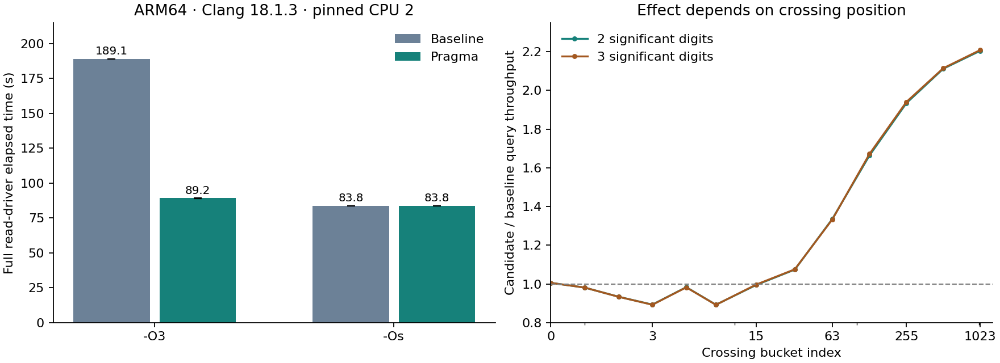

# ARM Clang percentile scan: cause, candidate and limits

The guarded unroll-control candidate improves the full ARM64 Clang 18.1.3
`-O3` read benchmark **2.120×**, with recording throughput effectively unchanged.
It is a reviewable candidate, **not an accepted optimization or an opened PR**.
The required Opus review is unavailable, and the short-scan tradeoff must be
visible to the reviewer. No accepted submodule pointer changed.

[Complete source/test patch against current upstream](upstream-candidate.patch)
· [review and remaining gates](REVIEW.md)
· [recomputed results](results.json)
· [input hashes](inputs.json)
· [raw artifact hashes](raw-sha256.json)



## What changes

Four lines in `get_value_from_idx_up_to_count_scalar`, immediately before the
inner loop that locates the exact crossing bucket:

```c
#if defined(__aarch64__) && defined(__clang__)
                /* Keep crossing-block prefix sums out of the block-sum loop. */
#pragma clang loop unroll(disable)
#endif
```

Clang documents this pragma as preventing loop unrolling. It controls this
transformation, not all subsequent scheduling or every future performance
outcome. [Clang loop-unrolling documentation](https://clang.llvm.org/docs/LanguageExtensions.html#loop-unrolling).

The arithmetic, offsets, bounds, scalar fallback, public API, allocation and
ABI remain unchanged. A new unit test covers dense crossings at every index,
isolated samples with empty buckets, empty histograms and rotated offsets at
precisions 1–3. Neither immutable benchmark driver is edited.

## Cause and controlled evidence

The original Clang ARM64 O3 code fully unrolls the crossing loop. Its generated
common scan reuses the intermediate prefix totals: each four-count block carries
the previous running total through **four dependent additions**. With the pragma,
Clang forms an independent SIMD block sum and adds the running total once.
The controlled source difference is only the guarded pragma/comment.

The full read benchmark changes from 189.088/189.148 seconds to
88.955/89.476 seconds. Checksums match. The same core, source baseline, compiler,
flags and callers are used in an ABBA order. This establishes a causal effect
of disabling that unroll on this build/workload; it does not assign every lost
cycle to one LLVM pass or establish all-platform speedups.

A second control disables **both vectorizers after the last `-O3` flag**, verifies
the emitted scan has no vector loads/reductions, and repeats bounded probes:

| Precision | Base ns/query | Patched ns/query | Throughput ratio |
| --- | ---: | ---: | ---: |
| 2 digits | 1160.221 | 880.937 | 1.317× |
| 3 digits | 7986.103 | 6072.635 | 1.315× |

That scalar-only candidate carries the running total through three additions,
versus four before. The gain without SIMD supports the dependency-chain
explanation. With ordinary flags, restoring vector reduction brings additional
gain; these controls do not establish an additive decomposition of the benefit.

Two earlier diagnostic flag attempts did **not** disable vectorization: the
CMake target's later `-O3` re-enabled it. Assembly assertions caught this.
Their logs are retained and excluded from the scalar-control claim. The final
control appends both disabling flags after O3. The standalone reduced example
in `reproducer/` reproduces the vectorization difference, but its baseline has
a balanced scalar sum; it does not reproduce the full library's four-add chain.

## Full unchanged drivers

Baseline is release-candidate PR #158
`d21d0843b492023077553b3eba26b3efa16c15f5`. The patch also applies cleanly to
current upstream `57db4223d1a356b21dbece675bce812419920c58`, where local GCC,
Clang no-log and ASan/UBSan checks pass. **Performance numbers below are at
the PR #158 pin**, not at that newer upstream revision.

| ARM64 / Clang 18.1.3 | Base | Candidate | Candidate/base throughput |
| --- | ---: | ---: | ---: |
| O3 recording, million ops/s | 409.914 | 411.398 | 1.0036× |
| O3 full read, seconds | 189.118 | 89.216 | **2.1198×** |
| Os recording, million ops/s | 414.277 | 414.801 | 1.0013× |
| Os full read, seconds | 83.828 | 83.833 | 0.9999× |

Each cell uses two completed invocations per variant. Write results are the
median of iterations 11–100 from each full 100-iteration driver. Read elapsed
time covers all 23 million queries including warmups, matching the preceding
fleet audit. O3 candidate read repetition differs by about 0.59%; base differs
by about 0.03%. The recording figures do not support claiming a material write
speedup. The candidate O3 read remains about **6.4% longer than Os**.

For all Intel/AMD GCC and Clang O3/Os builds, both immutable executables' entire
`.text` sections are byte-identical between base and candidate. ARM GCC O3/Os
and ARM Clang Os also match. The pragma is inactive for GCC/x86, and Clang Os
already avoids the problematic unroll. These paths receive native correctness
tests and ABBA bounded probes; redundant full unchanged-binary benchmarks were
not repeated. Hash evidence is in each runner's `scan-narrow-screen/inputs.json`.

## Short-scan tradeoff: this is not always faster

Supplemental single-sample histograms isolate where the crossing happens.
Two paired invocations per flag/variant, seven passes per scenario, first two
discarded; each pass makes two million p99 queries. Representative two-digit
O3 results (three digits show the same pattern):

| Crossing bucket index | Base ns/query | Candidate ns/query | Throughput ratio |
| --- | ---: | ---: | ---: |
| 0 | 4.58 | 4.55 | 1.006× |
| 3 | 4.87 | 5.45 | **0.893×** |
| 7 | 5.76 | 6.45 | **0.893×** |
| 31 | 10.95 | 10.19 | 1.074× |
| 127 | 43.01 | 25.77 | 1.669× |
| 1023 | 387.42 | 175.74 | 2.205× |

The largest observed relative loss is about 11%, approximately 0.6–0.7 ns/query,
for very early crossings. The rolled crossing loop costs more when little scan
work precedes it. The full benchmark and the two-/three-digit dense probes
benefit substantially, but a blanket no-read-regression claim would be false.
These are core timings, not Redis/Valkey request throughput or Supabase results.

## Correctness and profile evidence

- 24 native base/candidate configurations (three runners × two compilers × two
  flags × two variants) pass all five CTest suites with the new boundary test.
  Native candidate ASan/UBSan suites pass on all three runners.
- ARM's instrumented candidate completes 84,948 structured record/query fuzz
  executions and 19,593,045 decoder executions, each in a 61-second bounded run.
  No sanitizer errors occur. Independent no-vectorizer builds pass CTest too.
- All full-driver and supplemental scenario checksums match. No timed invocation
  required a competing-work retry. Intentionally stopped runs for rejected
  candidate A are preserved but excluded from completed measurements.
- The repository `scripts/run-profile.sh` profiles both paths with GCC/Clang,
  base/candidate, on all three runners. Its new optional `PROFILE_SECONDS` and
  `PERF_BIN` settings allow bounded samples with the installed kernel perf tool;
  default unbounded behavior remains available. Drivers stay unchanged.
- ARM read IPC rises from **2.76 to 6.09** in separate ten-second counter samples.
  The scan remains dominant; assembly and higher instruction parallelism support
  the removed serial dependency. Per-instruction cycle samples can skid and do
  not prove a particular instruction or cache is now the limiting resource.
  The remaining O3-versus-Os gap is not causally isolated here.
- Windows/MSVC, Apple Clang/macOS, LTO and other compiler versions have not been
  newly benchmarked by this experiment. The guarded directive adds no dependency
  or intrinsic, but those configurations still need their normal CI/review gates.

## Rejected alternative and experiment ledger

Candidate A (`candidate.patch`) moved the crossing work into the shared scalar
tail, removing eight net lines. ARM's full diagnostic improved from 189.176 to
90.428 seconds, but two complete AMD Clang O3 pairs yielded **0.8527×** read
throughput. Its AVX2 function is byte-identical (544 bytes, saved SHA-256) but
moves from offset `0x5d30` to `0x5d20`. Placement is a strong lead for the x86
regression; a dedicated alignment experiment was not performed. The broad
candidate is rejected; it is not shipped alongside the narrow pragma.

Initial boundary-test drafts used a nonexistent public helper, unsupported
precision zero and an insufficient highest-trackable range. These test-harness
errors were fixed before the fleet boundary-test runs. All failures and the
unsuccessful scalar-control flag attempts remain recorded.

## Reproduction and future protection

Use the same [inventories](../C-HARDENING-2026-10-01/fleet/RUNNERS.md) and
[CPU-pinning method](../C-HARDENING-2026-10-01/fleet/RUNNER-METHODOLOGY.md).
CPU 2 and the same SMT sibling checks, idle gate, interference thresholds and
controller lock apply. No compiler, clock, governor or host package changes
were made. All experiment controllers have finished and released their locks.

The committed runner scripts reconstruct the builds, source hashes, ABBA
probes, immutable-driver runs, native sanitizers/fuzzing and profiles.
`raw/<runner>/*.py` records the actual script versions deployed on that runner;
ARM's follow-up additionally includes the short-scan and fuzz controls.
Public text artifacts have trailing whitespace normalized; recorded source,
library and driver hashes identify the original measured inputs.
`python3 experiments/C-ARM-CLANG-SCAN-2026-10-01/analyze.py` recomputes the report's
machine-readable summaries without access to AWS.

The realistic protection is this narrow directive plus correctness tests and
repeated dedicated-runner benchmarks when compilers or release source change.
Unit tests cannot guarantee performance, and shared CI timing thresholds would
not replace the pinned measurements. Before publishing, revalidate the final
PR base and obtain the required upstream MERGE-READY review. See [REVIEW.md](REVIEW.md).
