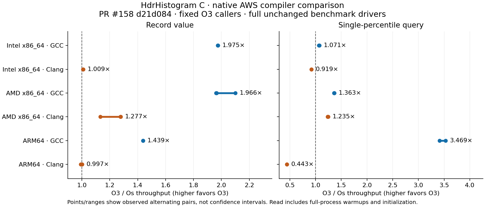

# Native Os/O3 results — 2026-10-01

**Do not switch all consumers to O3 indiscriminately.** GCC gains substantially on the tested machines; Clang has significant read regressions on Intel and ARM. Private HDR plus section garbage collection reduces executable size, but its timing effects depend on workload and executable layout. No source change or build default is accepted by this audit.

The primary source is PR #158 `d21d0843b492023077553b3eba26b3efa16c15f5`. This compares flags on the same revision, not 0.12.0 against a released version. Redis/Valkey embed a static HDR archive; these measurements are of that embedding and the core, not a public HDR shared library.

[Hardware, OS and toolchain inventories](RUNNERS.md) · [pinning and measurement method](RUNNER-METHODOLOGY.md) · [machine-readable results](results.json) · [input hashes](inputs.json)

## Full immutable benchmark drivers

Ratios are O3 throughput divided by Os throughput; above 1 favors O3. Parentheses show observed paired ranges, not confidence intervals. The write driver uses four significant digits; the read driver uses three.

| Runner | Compiler | Recording | Read driver | Complete pairs |
| --- | --- | ---: | ---: | ---: |
| Intel x86_64 | gcc | 1.975× (1.974–1.976) | 1.071× (1.066–1.076) | 2 |
| Intel x86_64 | clang | 1.009× (1.008–1.011) | 0.919× (0.918–0.920) | 2 |
| AMD x86_64 | gcc | 1.966× (1.962–2.100) | 1.363× (1.359–1.364) | 3 |
| AMD x86_64 | clang | 1.277× (1.133–1.279) | 1.235× (1.233–1.244) | 3 |
| ARM64 | gcc | 1.439× (1.438–1.439) | 3.469× (3.409–3.529) | 2 |
| ARM64 | clang | 0.997× (0.992–1.002) | 0.443× (0.443–0.443) | 2 |

Each invocation records approximately 40 billion values and completes all 23 million read queries, including warmups. Write summaries discard the first ten of 100 iterations. Read ratios use precise full-process wall time, including setup/warmups, because printed Mqueries/s is rounded too coarsely. Callers remain O3; library flags vary, with no core LTO.

AMD required a third pair for each compiler after repeated-binary variation exceeded 5%. ARM GCC Os read elapsed time varied about 3.5%. All observations remain in the data. These are directional compiler results, not a claim that every cell meets the workspace’s 1% precision gate. CPU 2 is fixed within each runner; SMT siblings and other CPU work are monitored. Clocks/turbo are not locked.

## Server-shaped, two-digit supplemental probe

Both server snapshots use range 1..1e9 and two significant digits. Their benchmark clients default to three digits with different ranges. The following matches server range/precision but uses synthetic sequential writes and dense queries, not actual command latency distributions or Redis/Valkey requests per second.

| Runner | Compiler | Recording O3/Os | Queries O3/Os |
| --- | --- | ---: | ---: |
| Intel x86_64 | gcc | 1.698× | 1.617× |
| Intel x86_64 | clang | 1.133× | 1.246× |
| AMD x86_64 | gcc | 2.129× | 1.167× |
| AMD x86_64 | clang | 1.279× | 1.250× |
| ARM64 | gcc | 1.403× | 3.398× |
| ARM64 | clang | 1.015× | 0.431× |

Intel Clang improves two-digit queries while regressing three-digit queries. ARM Clang regresses both tested precisions under O3. The older `bcb5c1f` reference probes are retained separately in JSON; their revision order was not interleaved, so they are not a release-regression acceptance test.

## Final executable sizes

The matrix fixes GCC O3/LTO application objects, libc allocation, TLS off and systemd off. Private means HDR-only `-fvisibility=hidden -ffunction-sections -fdata-sections` plus final `--gc-sections`; SIMD dispatch remains enabled. These options intentionally remove incidental HDR executable exports while retaining all non-HDR exports.

Stripped executable bytes (Intel and AMD rows are identical):

| Architecture | Consumer | Executable | Os | O3 | Private Os | Private O3 |
| --- | --- | --- | ---: | ---: | ---: | ---: |
| x86_64 | redis | server | 4,222,808 | 4,231,000 | 4,210,520 | 4,210,520 |
| x86_64 | redis | benchmark | 305,800 | 313,992 | 297,608 | 297,608 |
| x86_64 | valkey | server | 4,199,440 | 4,207,632 | 4,187,152 | 4,187,152 |
| x86_64 | valkey | benchmark | 507,160 | 515,352 | 494,872 | 498,968 |
| ARM64 | redis | server | 4,147,664 | 4,147,664 | 4,082,128 | 4,082,128 |
| ARM64 | redis | benchmark | 330,128 | 330,128 | 330,128 | 330,128 |
| ARM64 | valkey | server | 4,149,768 | 4,149,768 | 4,149,768 | 4,149,768 |
| ARM64 | valkey | benchmark | 527,416 | 527,416 | 527,416 | 527,416 |

Plain O3 increases the x86 text column by about 8.6 KB and stripped files by 8 KiB. Private O3 and private Os have identical stripped **server** sizes on all three runners, although their code sections differ. ELF alignment masks some differences, particularly on ARM. Private Os saves 12 KiB per x86 stripped server and 64 KiB for the ARM Redis server; ARM Valkey’s stripped server size does not change. See section-level data in JSON rather than treating file alignment as instruction savings.

All 48 server/benchmark executables retain non-HDR dynamic exports. Private variants remove 40 `hdr_*` exports plus `counts_index_for`. Applications resolving those incidental HDR symbols dynamically would need their own linkage. The supported module-facing exports stay intact. Histogram allocation remains **24,680 bytes** for the tested server configuration, before allocator overhead.

## Private-build timing countercheck

The actual GCC consumer archives were also linked to a fixed bounded caller. AMD’s private O3 probe stays near ordinary O3. Intel’s two-digit short probe records at only about 0.609× ordinary O3 throughput, while its read throughput stays near parity.

A separate Intel countercheck links the actual archives to both full unchanged drivers, in opposite order. Here private O3 records **1.060×** as fast (paired range 1.060–1.061), with read throughput **0.999×** ordinary O3. The recording function is byte-identical in these two executables (176 bytes), but placement differs; [hash evidence](intel-codegen-equivalence.json) and disassembly are retained.

The short and full results disagree. This supports treating the private build as workload/layout-sensitive; it does not establish a universal penalty, universal benefit or performance neutrality. A production default needs measurement in the final consumer executable. Actual-archive probe data for all runners are retained in `embedded` in the results JSON.

## Correctness, profiles and limits

- 24 core configurations × five CTest suites passed: 120 successful CTest executions, covering both revisions, both flags and both compilers on all three architectures. Current-revision full benchmarks pass with unchanged driver sources and fixed O3 caller flags.
- All 24 consumer variants pass PING, latency-statistics checks, and detailed SET/GET benchmark output with one and two threads. All 24 allocator/iterator contract probes pass against their actual archives. Each downstream allocator adapter and iterator extension is preserved.
- Read-driver result checksums and bounded-probe checksums match across architectures, flags and revisions. No measured invocation required a competing-work retry.
- Eight cycle profiles per machine cover both paths, flags and compilers. GCC Os spends recording cycles in separate counted-record/index helpers; O3 folds the hot work into `hdr_record_value`. On x86 the AVX2 scan remains the read bottleneck. ARM profiles concentrate in the scalar/compiled percentile implementation. Disassembly is saved to examine compiler choices; profiles alone do not prove the cause of every timing difference.
- The prior local Redis 125-test and Valkey 61-test runs are historical results at the earlier pin. They were not rerun as full consumer suites on this fleet. This fleet validation does not test Node/Supabase, public shared-library ABI, every allocator/TLS configuration, HDR LTO alternatives or SIMD-disable performance.

## Decision and handoff

ARM Clang disassembly gives a concrete lead for its read regression. Under Os,
the four-counter block uses vector loads/reduction to form an independent block
sum, then adds the running total once. Under O3, the scalar addition chain folds
the running total into the first addition and carries it through all four
prefix additions. GCC O3 instead forms independent partial sums before adding
the running total. This longer loop-carried dependency in Clang O3 is consistent
with the measured slowdown. The responsible optimizer pass has not been isolated;
no source workaround is implemented here. The native read disassemblies are
saved under each runner's `raw/.../results/codegen-*-read.txt`.

Keep the downstream adapter/iterator preservation work. Treat GCC O3 as a promising consumer-specific performance option; retain compiler/platform configurability. Do not impose O3 globally, particularly for Clang on ARM. Keep private-core size flags separate and measure their effect in final consumer workloads before changing defaults. A follow-up hypothesis is targeted inlining of hot recording helpers while retaining size optimization for cold code; it is not implemented or accepted here.

The original vendor patch files remain pinned to `bcb5c1f`; regenerate the adaptation from the desired release SHA with `scripts/prepare-hdr-vendor.py` before adoption. The fleet builds themselves use `d21d084`. Decoder hardening and optional minimal-core build work remain separate from this compiler audit. The parent hardening report retains the scoped Supabase assessment; no new Supabase runtime claim is made here.

No upstream PR, push or accepted submodule change is made by this validation. Upstream MERGE-READY review remains a separate gate.
