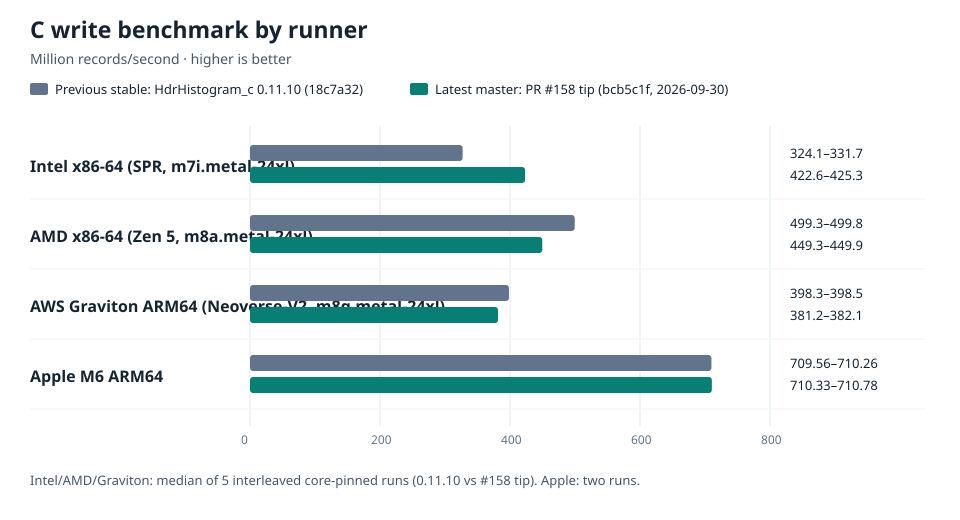
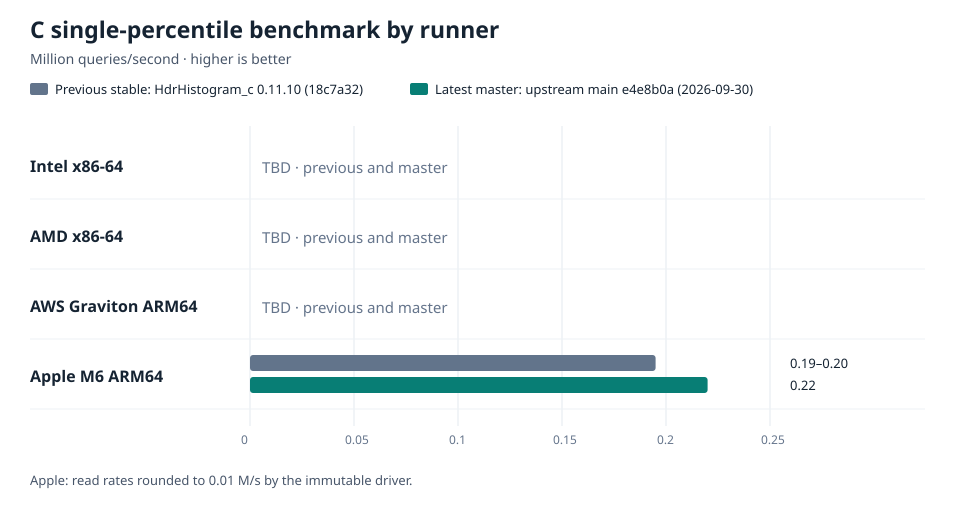
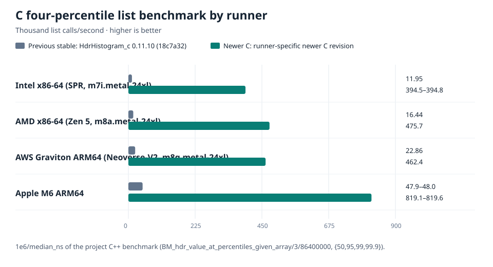

# HdrHistogram_c performance by architecture

## Previous stable versus measured newer C revisions

The write and single-read charts use the immutable C project benchmark drivers;
the list chart uses the project's unchanged Google Benchmark C++ driver for
`hdr_value_at_percentiles` with four percentiles. The Apple bars show
two interleaved runs per revision. Intel, AMD, and AWS Graviton read/list were
measured 2026-09-30 on the AWS benchmark fleet (0.11.10 `18c7a32` vs PR #158 tip),
median of interleaved core-pinned runs; raw logs in
[`C-PERFORMANCE-CHARTS/fleet-raw-2026-09-30/`](C-PERFORMANCE-CHARTS/fleet-raw-2026-09-30/).
The **write** rows were re-measured 2026-10-01 at the fixed #158 tip `d21d084`
(same-session, interleaved, 3-point prev/old-tip/fixed-tip); raw logs in
[`C-PERFORMANCE-CHARTS/fleet-raw-2026-10-01-writefix/`](C-PERFORMANCE-CHARTS/fleet-raw-2026-10-01-writefix/).
Higher is better. These are **different newer source points**, not a direct
cross-runner comparison of one revision:

| Runner | Write newer point | Read/list newer point |
|---|---|---|
| Intel, AMD, AWS Graviton | PR #158 `d21d084` | PR #158 `bcb5c1f` |
| Apple M6 | Then-upstream `main` `e4e8b0a` | Then-upstream `main` `e4e8b0a` |

As checked on 2026-10-01, upstream `main` had advanced to `57db422` (#159),
so none of these newer rows is an exact measurement of that `main` revision.

### Why Apple appears much faster in two charts

The absolute gap was already present in the **old release**: Apple M6 wrote
about 710 million records/s versus about 330 million on Intel Sapphire
Rapids, 500 million on AMD Zen 5, and 398 million on Graviton. Its old-release
four-percentile-list rate was about 48 thousand calls/s versus 12, 16, and
23 thousand respectively. The newer batch work therefore did not create the
M6 lead. On single-percentile reads, Apple is actually *slower* than both
x86 runners in these measurements (0.22 versus 0.47/0.89 M queries/s).

The exact cause of the absolute gap is **not established**. The runs used
different processors, OSes, compilers, and source revisions; the fleet logs
do not retain full compiler flags or per-run clocks. The write driver records
a predictable increasing sequence, and the list driver repeatedly queries a
fixed four-percentile array, so these numbers describe those microbenchmarks,
not general application throughput. CPU execution speed, cache behavior, and
compiler code generation are plausible contributors, but these data cannot
separate their effects. To attribute the gap, collect the same exact C commit
and build flags on all four runners, record compiler versions and effective
clocks, then profile the two hot loops on each processor.

The list benchmark has another comparability flaw: it builds its input using
`std::default_random_engine` and `std::gamma_distribution`. On this Apple
build, the default engine is `minstd_rand`; [libstdc++ uses `minstd_rand0`](https://gcc.gnu.org/onlinedocs/libstdc%2B%2B/latest-doxygen/a00641.html),
while [libc++ uses `minstd_rand`](https://github.com/llvm/llvm-project/blob/main/libcxx/include/random).
The resulting histograms need not be identical. A controlled
[Apple M6 probe](C-PERFORMANCE-CHARTS/rng-probe-apple-m6.txt) using the same
C revision and gamma distribution confirmed different input hashes and small
percentile-output differences, but changing *only* the engine gave 1,217.90
versus 1,217.52 ns/list in that run. Thus the engine difference is a real
workload mismatch, but it does **not** explain the observed ~2× newer-list
gap by itself. The fleet runs did not record histogram fingerprints, so the
effect of the full cross-library input difference remains unquantified.

The Apple write chart labels show the range of its two run medians; fleet
write labels show the range of five interleaved runs. The Apple read bar uses
the midpoint of the driver's *rounded* reported rates (stable 0.19–0.20,
then-main 0.22 M/s); its bar length is visual only, not a precise effect-size
estimate. [Raw paired output](OPT-ROUND-2026-09-30/bench-results/) and
[chart data/source](C-PERFORMANCE-CHARTS/) are available for updates.

The Apple list chart uses `BM_hdr_value_at_percentiles_given_array/3/86400000`
(`{50,95,99,99.9}`, 10 million gamma-distributed records). AppleClang 21,
RelWithDebInfo, two interleaved invocations per revision, five timed Google
Benchmark repetitions per invocation: stable medians 20,846 and 20,894 ns per
four-percentile list; then-main `e4e8b0a` 1,221 and 1,220 ns. The plotted throughput
is `1e6 / median_ns` in thousand list calls/second: about 48 versus 819,
or ~17.1×. The benchmark library itself reports a debug-build warning, so
this magnitude is corroborated by the separately validated
[supplemental batch probe](OPT-ROUND-2026-09-30/batch_probe.c); the precise
effect size still needs native cross-compiler confirmation. Its [raw output](OPT-ROUND-2026-09-30/list-results/)
has genericized host labels for this public repository.

## Other C evidence (different benchmarks)

This page covers the **C implementation**. Results are from distinct workloads and
dates; rows from different machines are **not** a controlled cross-architecture
speed ranking. The source revision, benchmark, and evidence are attached to each
result. `TBD` means that a fresh native result has not been supplied yet.

## Dense C: available measurements

| Architecture | C revision and workload | Write | Single-percentile read | Evidence |
|---|---|---:|---:|---|
| Intel x86-64, Granite Rapids (Xeon 6972P) | Historical C submodule tip, cross-language harness, varied writes and log-normal reads | 415 M records/s (2.41 ns/record) | 767 K queries/s (1,303 ns/query) | [Harness and method](CROSS-LANG/RESULTS.md) |
| AMD x86-64, Zen 5 (m8a.metal-24xl) | #158 fixed tip `d21d084` write (same-session 3-pt); read at `bcb5c1f` | 489.0 M records/s (0.11.10: 500.2, **−2.2%**) | 0.89 M queries/s (0.11.10: 0.42, **+112%**) | [write](C-PERFORMANCE-CHARTS/fleet-raw-2026-10-01-writefix/amd-w2.out) · [read](C-PERFORMANCE-CHARTS/fleet-raw-2026-09-30/amd.out) |
| ARM64, AWS Graviton / Neoverse-V2 (m8g.metal-24xl) | #158 fixed tip `d21d084` write (same-session 3-pt); read at `bcb5c1f` | 393.5 M records/s (0.11.10: 398.4, **−1.2%**) | 0.11 M queries/s (0.11.10: 0.09, **+22%**) | [write](C-PERFORMANCE-CHARTS/fleet-raw-2026-10-01-writefix/arm-w3.out) · [read](C-PERFORMANCE-CHARTS/fleet-raw-2026-09-30/arm.out) |
| Intel x86-64, Sapphire Rapids (m7i.metal-24xl) | #158 fixed tip `d21d084` write (same-session 3-pt); read at `bcb5c1f` | 344.9 M records/s (0.11.10: 329.7, **+4.6%**) | 0.47 M queries/s (0.11.10: 0.27, **+74%**) | [write](C-PERFORMANCE-CHARTS/fleet-raw-2026-10-01-writefix/intel-w3.out) · [read](C-PERFORMANCE-CHARTS/fleet-raw-2026-09-30/intel.out) |
| ARM64, Apple M6 | Upstream `e4e8b0a` (2026-09-30), immutable project write/read drivers | 710.33–710.78 M records/s, two runs | 0.22 M queries/s, two runs | [Post-merge round and raw logs](OPT-ROUND-2026-09-30/STATUS.md) |

The read/list deltas above span **every** change from 0.11.10 to the #158 tip
(all merged PRs), not #158 alone, and are within-runner on the same box. Read gains
are large and consistent everywhere.

**Write is ~flat (within ±5%) at the fixed #158 tip** (`d21d084`): Sapphire Rapids
+4.6%, Zen 5 −2.2%, Neoverse-V2 −1.2%. An earlier tip (`bcb5c1f`) showed much larger
write swings — SPR +28%, Zen 5 −10%, N-V2 −4.2% — but a same-session 3-point run
(0.11.10 / `bcb5c1f` / `d21d084`) showed those swings are a **code-layout artifact** of
a `count < 0` guard that sat on the single-value record hot path: the only write-path
diff from 0.11.10 is that one always-not-taken branch, yet its effect on code alignment
swung +28% on SPR and −10% on Zen 5. The fix (`d21d084`) keeps that check only on the
explicit `*_values(count)` API, off the single-value hot path, so write returns to ~flat
across all three server uarches. The write change is therefore **not** a write
optimization claim in either direction; #158's value is the read/list path. Apple M6 was
measured at `e4e8b0a`, not #158. #158's **single-percentile AVX2** change is
x86-only, but it also removes a negative-count check from the **scalar batch**
scan. An Apple supplemental dense-seven-list probe measured 2.45 µs at
`e4e8b0a` versus 1.31 µs at the earlier #158 tip `bcb5c1f` on that workload.
Thus the Apple list row is **not** a proxy for #158; its write was not
re-measured at the fixed #158 tip either. See the [post-merge round](OPT-ROUND-2026-09-30/STATUS.md).

The Intel result uses `gcc -O3 -march=native`, one pinned core, and the
[cross-language C harness](CROSS-LANG/c/microbench.c). Its exact C source hash
was not recorded in that historical run; it must **not** be presented as a
measurement of today's `main`. The Apple result uses AppleClang 21, arm64,
RelWithDebInfo, and the repository's immutable benchmark drivers. The Intel
and Apple numbers use different histogram populations and timing protocols;
compare revisions **within** a row's experiment, not the absolute speeds
between those rows. The Apple read driver prints only 0.01 M queries/s, so its
stable-to-main change is directional at that resolution.

For the Apple same-session comparison, release 0.11.10 (`18c7a32`) measured
709.56 and 710.26 M writes/s and 0.20 and 0.19 M single reads/s. Pre-batch
master (`4395fa0`) measured 713.41 and 709.89 M writes/s and 0.22 M reads/s
in both runs. Latest master (`e4e8b0a`) measured 710.78 and 710.33 M writes/s
and 0.22 M reads/s. The unchanged pre-batch binary itself drifted by 0.5% on
writes, so the sub-1% write differences are not an optimization claim.

## Packed C: historical three-architecture experiment

The C packed histogram in [PR #150](https://github.com/HdrHistogram/HdrHistogram_c/pull/150)
is a separate, experimental data structure. The table below compares packed C
branch `f58401c` before and after a **one-entry last-hit cache patch**. That
patch is a follow-up experiment and is **not** in dense `main` or implied to be
in PR #150. These are median ns/record over three runs; lower is better.

| Write pattern | Intel x86-64, Granite Rapids | AMD x86-64, Zen 5 | ARM64, AWS Graviton / Neoverse-V2 |
|---|---:|---:|---:|
| Random / low locality | 75.1 → 76.0 (+1.2%) | 65.7 → 66.4 (+1.1%) | 69.3 → 70.6 (+1.8%) |
| Clustered / high locality | 16.9 → 6.9 (−59%) | 13.5 → 5.7 (−58%) | 16.8 → 9.5 (−44%) |
| Hot90 / 90% at one bucket | 25.7 → 17.8 (−31%) | 20.6 → 14.2 (−31%) | 27.2 → 22.0 (−19%) |

All three architecture runs passed CTest 6/6 on both source points and matched
the packed histogram's populated-bucket and total-count checks. The packed
test also passed ASan/UBSan. The cache adds about 1–2% to low-locality writes
while improving bursty writes; it has not cleared the workspace's acceptance
gate. [Original run diary, Tick 24](iop-vs-hdr/JOURNAL.md#tick-24--2026-08-26-1750-utc--c-write-cache-3-arch-server-validation)
and [patch/method](iop-vs-hdr/optim/README.md) contain the details.

The existing `hdr-dense` and `hdr-packed` Intel/AMD/ARM tables in the main
README's competitor section measure the **Rust crate**, not HdrHistogram_c.
They must not be reused as C results.

## What remains for a current-main architecture matrix

The fleet has measured Intel, AMD, and AWS Graviton, but its newer point is
PR #158 while Apple's is an older `main` commit. Repeat the same current-main
commit and build settings on all four runners, with compiler versions,
checksums, effective-clock or frequency data, and matched profiles. Until
then, the chart supports **within-runner** improvement claims only. AVX2
behavior and gcc-versus-clang performance cannot be qualified on Apple arm64.
