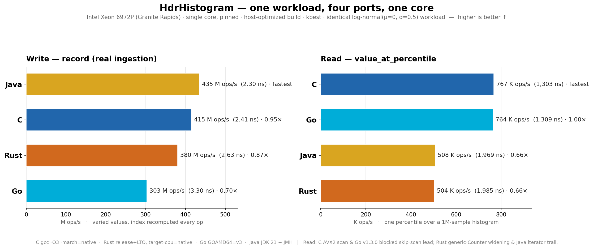

# Cross-language HdrHistogram benchmark — C / Go / Rust / Java

The **same workload** run through each HdrHistogram implementation on **one core of one
machine**, so the ports can be compared operation-for-operation. Two operations every port
exposes as a real, single API:

- **write** — `record` a value
- **read** — `value_at_percentile` (one percentile over a 1M-sample histogram)

Batch percentile APIs are deliberately excluded: the Java reference implementation has no
single-call batch API, so there is no fair cross-language batch comparison (looping
`value_at_percentile` N times is not the same operation).



## Results (kbest, ns/op — lower is faster)

| Operation | C | Go | Rust | Java |
|-----------|----:|----:|----:|----:|
| write · varied (real ingestion) | 2.41 | 3.30 | 2.63 | **2.30** |
| write · constant (index hoisted) | **1.93** | 2.70 | 2.35 | **1.93** |
| read · single percentile | **1,303** | 1,309 | 1,985 | 1,969 |

Throughput (= 1000 / ns_per_op):

| Operation | C | Go | Rust | Java |
|-----------|----:|----:|----:|----:|
| write · varied | 415 M/s | 303 M/s | 380 M/s | **435 M/s** |
| read · single pct | **767 K/s** | 764 K/s | 504 K/s | 508 K/s |

## What it shows

- **Reads split into two camps.** C's AVX2 prefix-sum scan and Go's blocked prefix-sum
  skip-scan (the v1.3.0 read work) lead at ~1,300 ns; Rust's generic `Counter` widening and
  Java's iterator-based percentile trail at ~1,980 ns (~1.5× slower).
- **Writes are close** — Java ≈ C > Rust > Go, all within ~1.4× on real (varied) ingestion.
- **The constant-write row is a benchmark artifact.** Recording a *constant* value lets
  aggressive optimizers (GCC, the Java C2 JIT) hoist the per-op bucket-index computation out
  of the loop and drop the bounds check, collapsing C and Java to 1.93 ns. That is not
  representative of ingesting real (varied) data — the "write · varied" row is.

## Why Go trails on writes — and why it isn't fixable at the library level

Java records ~1.4× faster than Go on real ingestion (2.30 vs 3.30 ns) despite Go's record
path doing **strictly less work**: `hdrhistogram-go` does not maintain min/max on the write
path (`Min()`/`Max()` scan lazily at query time), whereas Java's `recordValue` updates both on
every call. So the gap is codegen, not work.

The Go compiler names the cause directly (`go build -gcflags=-m`):

```
cannot inline (*Histogram).RecordValues: function too complex: cost 288 exceeds budget 80
        v escapes to heap in (*Histogram).RecordValues
        n escapes to heap in (*Histogram).RecordValues
```

1. **The record path won't inline.** `RecordValues` is inherently over Go's inliner budget
   (the bucket-index math alone — `LeadingZeros64` + shifts — is ~79 vs the budget of 80), so
   every `record` is a real function call with no cross-call optimization: `h`'s fields are
   reloaded each iteration and nothing is scheduled across the loop. Java's C2 JIT inlines the
   whole chain flat into the caller and schedules it across iterations. Go has **no
   force-inline directive and no LTO / whole-program optimization** — there is no library edit
   that changes this.
2. **A tested micro-lever went nowhere.** The two inline `fmt.Errorf` calls both inflate the
   inliner cost and heap-escape `v`/`n` (they are passed to a `...interface{}` arg on the
   error branch). Outlining them into `//go:noinline` cold helpers removes the escape and cuts
   the cost to 236 — verified, tests green — but a same-machine A/B on Granite Rapids
   (GOAMD64=v3, kbest of 10 × 20 s, core 8) showed **base 2.586 vs patched 2.581 ns/op —
   0.2%, inside the noise**, distributions fully overlapping. It doesn't help because the
   escape lives on the never-taken error branch (0 allocs/op both ways) and `RecordValues`
   still doesn't inline (236 ≫ 80). **Rejected — no PR.**

**Conclusion:** the Go write path is already at its practical floor for a one-value-per-call
API on the Go compiler. The remaining ~1 ns vs Java is the price of Go's deliberately-simple
compiler + per-call ABI, not a defect in the port. The only library-level lever left is a
**bulk/batch record API** to amortize the call overhead — which the one-value-per-call
benchmark driver does not exercise.

## Methodology (fairness)

- **Same workload everywhere:** histogram bounds `(1, 1e6, 3 sig-figs)` for reads (write uses
  `(1, 1e7, 3)` pre-filled `0..1e6`, mirroring the Go driver); the read histogram is filled with
  1,000,000 samples from a **log-normal(μ=0, σ=0.5)** distribution scaled to the tracked range;
  reads query random percentiles in `[0,100)`; the "varied" write records shuffled values in
  `[0,1e6)`. Each language generates an independent, statistically-identical sample (matched
  parameters, its own RNG).
- **One core, pinned:** every run `taskset -c <core>` on an isolated core, single-threaded.
- **kbest:** report the minimum ns/op over the samples (least perturbed by system interference).
- **Dead-code elimination defeated:** native ports use a `volatile` / `black_box` sink; Java
  uses JMH `Blackhole`.
- **Fair per-runtime method:**
  - **C** — `gcc -O3 -march=native`, hand-rolled best-of-5 × 10 s timed loop.
  - **Rust** — `cargo release`, `target-cpu=native`, LTO, hand-rolled best-of-5 × 10 s.
  - **Go** — `GOAMD64=v3`, hand-rolled best-of-5 × 10 s.
  - **Java** — JDK 21 + **JMH** (warmup excluded → steady state, `Blackhole`, best of
    2 forks × 5 × 30 s). JMH is required for a JIT runtime; a raw timed loop would be unfair to
    Java (no warmup, dead-code elimination).

Machine: **Intel Xeon 6972P (Granite Rapids)**, single core.
Library versions: C & Rust & Go submodule tips at time of run (Go = v1.3.0); Java
`org.hdrhistogram:HdrHistogram:2.2.2`.

## Reproduce

Harnesses are in this directory: [`c/microbench.c`](c/microbench.c),
[`rust/`](rust/), [`go/`](go/), [`java/HdrBench.java`](java/HdrBench.java).

```sh
# C  (needs HdrHistogram_c src/include)
gcc -O3 -march=native -DNDEBUG -I <hdr_c>/include -I <hdr_c>/include/hdr -I <hdr_c>/src \
    c/microbench.c <hdr_c>/src/hdr_histogram.c -lm -o cbench
taskset -c 8 ./cbench 10 5            # <target_seconds> <reps>

# Rust  (Cargo.toml path-depends on ../HdrHistogram_rust)
RUSTFLAGS="-C target-cpu=native" cargo build --release
taskset -c 8 ./target/release/rbench 10 5

# Go  (go.mod replaces the module with the local ../hdrhistogram-go)
GOAMD64=v3 go build -o gobench .
taskset -c 8 ./gobench 10 5

# Java  (JMH; jars: jmh-core, jmh-generator-annprocess, jopt-simple, commons-math3, HdrHistogram)
javac -cp <jars> -processorpath jmh-generator-annprocess.jar:<jars> -d classes java/HdrBench.java
taskset -c 8 java -cp classes:<jars> org.openjdk.jmh.Main \
    -f 2 -wi 3 -w 3s -i 5 -r 30s -tu ns -rf json -rff results.json
```

Regenerate the chart from the numbers hard-coded in the script:

```sh
python3 plot_4lang.py     # -> cross-lang-granite-rapids.png
```
