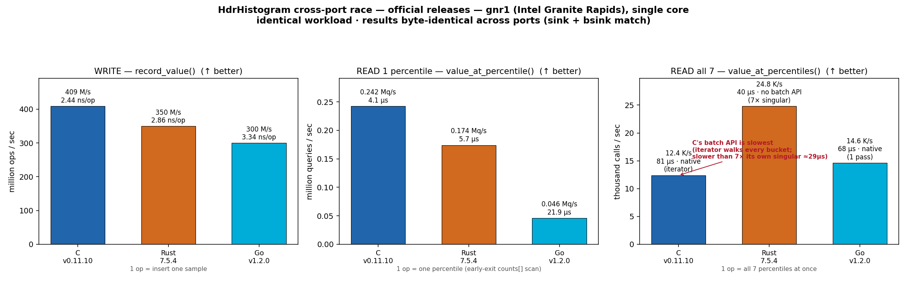
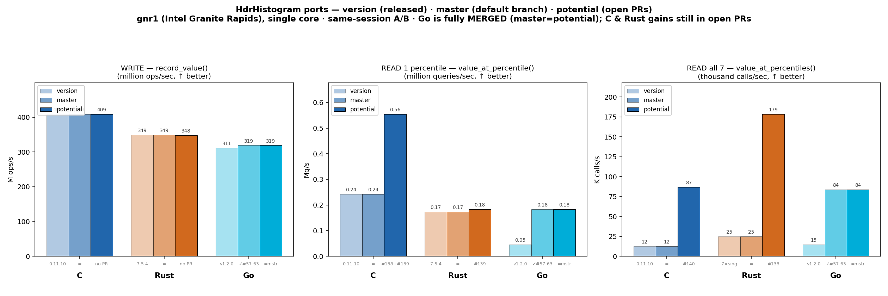
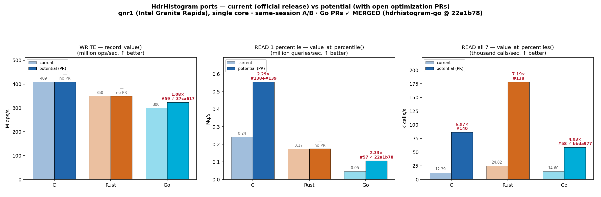
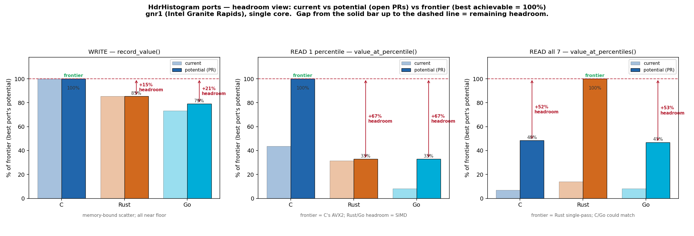

# Cross-Port Race — C vs Rust vs Go

A head-to-head baseline of the three **official released** HdrHistogram ports on an **identical
workload**, so the numbers are directly comparable. Driver sources live in [`../race/`](../race/) —
one program per language, byte-for-byte the same algorithm.



## Versions raced (2026-07-02)

| Port | Version | Commit | Percentile read path |
|------|---------|--------|----------------------|
| C    | **0.11.10** | `18c7a32` | AVX2 scan (4×int64/iter) + scalar fallback |
| Rust | **7.5.4**   | `a3818d6` | scalar `counts[]` scan |
| Go   | **v1.2.0**  | `7de3c99` | iterator walk |

## Metrics — what the numbers mean

Three throughput metrics; **compare each one across ports** (a read "op" is far heavier than a write "op").

- **WRITE — `record_value()` ops/sec** (↑ better). One op = insert a single sample (bucket index →
  counter++ → min/max). The **hot path** (every recorded sample). In million ops/sec + ns/op.
- **READ 1 percentile — `value_at_percentile()` q/sec** (↑ better). One op = one percentile query =
  scan the `counts[]` prefix-sum until the cumulative count crosses the target. In Mq/s + µs/query.
- **READ all 7 — `value_at_percentiles()` calls/sec** (↑ better). One op = get **all 7** percentiles
  `{50,75,90,95,99,99.9,99.99}` in one call. C & Go have a native single-pass batch API; **Rust has
  none**, so it does 7× singular (7 independent scans). In thousand calls/sec + µs.

**Correctness cross-checks** (must match across ports — they do): singular `sink` =
`11311209184862912`; batch `bsink` = `4263457582300000`. Same percentile values everywhere.

## Version → master → potential (fresh 3-column measurement, 2026-07-02)



Each port measured in **three states**, same-session on gnr1, single core, core-pinned, best-of-N
(raw: [`RACE-baseline/2026-07-02-gnr1-3col-raw.txt`](RACE-baseline/2026-07-02-gnr1-3col-raw.txt)):

- **version** — the released tag a user installs today (C `0.11.10`, Rust `7.5.4`, Go `v1.2.0`)
- **master/main** — current default-branch HEAD (whatever has merged since the release)
- **potential** — default branch + **all** open optimization PRs from this workspace, cherry-picked
  into one tree (C `e081c5d` = #138+#139+#140; Rust `0f6a5d2` = #138+#139; Go = nothing open — all merged)

> **Go is fully merged.** All five perf PRs (#57/#58/#59, then #62/#63 on 2026-07-03) have landed on
> `master` (`ebe2303`), so Go's `master` **is** its `potential` — no gap left. C and Rust have shipped
> nothing since their release, so their `version` and `master` bars are identical and every gain still
> sits in `potential` (open PRs). The batch column uses each state's *best available* API: C
> `hdr_value_at_percentiles` throughout; Rust 7×singular until the native batch (#138); Go
> `ValueAtPercentiles` until the ordered-slice API (#63, now merged).

| metric | C ver=master | C potential | Rust ver=main | Rust potential | Go version | Go master = potential |
|--------|-------------:|------------:|--------------:|---------------:|-----------:|----------------------:|
| WRITE (M ops/s)     | 408.9 | 409.2 | 348.8 | 347.8 | 311.4 | 319.0 |
| READ-1 (Mq/s)       | 0.2425 | **0.5550** (2.29×) | 0.1741 | 0.1828 (1.05×) | 0.0457 | **0.1833** (4.01×) |
| READ-7 (K calls/s)  | 12.4 | **86.8** (7.0×) | 24.8 | **178.6** (7.2×) | 14.6 | **83.6** (5.7×) |

All cells cross-checked byte-identical (`sink`/`bsink` unchanged across every state). C/Rust `potential`
multipliers are vs their own `version=master`; Go's are the full released→merged arc (`version` → today's
`master`). Go's `master`==`potential` numbers were measured on the code-identical pre-merge tree (`99baaee`,
= `master` + #62 + #63 cherry-picked); the squash-merges `ebe2303`/`6b5dd0d` are the same code. Note READ-1
is now a **near-tie at the frontier for Rust-potential/Go-merged** (0.1828 vs 0.1833) — both scalar scans,
~3× behind C's AVX2 potential (0.5550): the remaining headroom is SIMD.

## Methodology

- **Host**: `gnr1` — Intel Granite Rapids, single core (`taskset -c 8`), same box/session for all three.
- **Config** (all ports): `histogram(lowest=1, highest=3_600_000_000, sig_figs=3)`.
- **WRITE**: record `v = 1..50,000,000`; 5 reps; best ops/sec.
- **READ populate**: 1,000,000 Fibonacci-hash-spread values (`(v*2654435761) mod 1e9 + 1`, `v=1..1e6`).
- **READ 1**: 1,000,000 singular queries cycling the 7 percentiles; 3 warmup + 10 timed; best Mq/s.
- **READ all 7**: 100,000 batch calls (each returns all 7); 2 warmup + 5 timed; best K calls/sec.
- **Build**: C `cc -O3 -march=native` (static lib); Go `go build`; Rust `cargo build --release` (LTO).

## Scoreboard

| Port | WRITE ops/sec | ns/op | READ 1 Mq/s | µs/query | READ all-7 calls/sec | µs/7 |
|------|--------------:|------:|------------:|---------:|---------------------:|-----:|
| **C** v0.11.10   | **408,985,885** | **2.44** | **0.2425** | **4.12** | 12,389 (iterator) | 80.7 |
| Rust 7.5.4       | 349,643,213 | 2.86 | 0.1741 | 5.74 | **24,818** (7× singular) | **40.3** |
| Go v1.2.0        | 299,670,657 | 3.34 | 0.0457 | 21.88 | 14,604 (1 pass) | 68.5 |

Relative to C (C = 1.00×):

| Port | WRITE | READ 1 | READ all-7 |
|------|------:|-------:|-----------:|
| C    | 1.00× | 1.00× | 1.00× |
| Rust | 0.86× | 0.72× | **2.00×** |
| Go   | 0.73× | 0.19× (C **5.3×**) | 1.18× |

## Findings

1. **Correctness**: all three ports return byte-identical results for both single and batch queries
   (`sink` + `bsink` match) — a strong cross-port equivalence check.
2. **WRITE**: C leads (409 M/s), Rust 0.86×, Go 0.73× — within ~1.37×. Memory-bound on the `counts[]`
   scatter in every language, so the spread is modest.
3. **READ 1 percentile**: C fastest; **Rust is close (1.39× behind)**; **Go is far behind — 5.3× slower
   than C** (21.9 µs/query). Go's `ValueAtPercentile` walks buckets via an iterator instead of a tight
   early-exit prefix-sum scan → the biggest single-metric gap in the race.
4. **READ all 7 — the plot twist**: **C's native `hdr_value_at_percentiles` is the *slowest* way to
   get 7 percentiles** (80.7 µs). It's iterator-based (walks *every* bucket once), so it's even slower
   than calling C's own fast singular scan 7× (~29 µs). Rust "wins" this column only because it has
   **no batch API** and falls back to 7× its fast singular scan (40.3 µs). Go's native batch (68.5 µs)
   *does* beat its own 7× singular (153 µs), but on a slow base.

## Optimization opportunities (ranked) — progress

1. **Go — singular read** (was 5.3× behind C): ✅ **DONE** — replaced the iterator walk in
   `ValueAtPercentile` with a flat `counts[]` prefix-sum scan. **+133%** (0.0457 → 0.1066 Mq/s), now
   ~2.3× behind C instead of 5.3×. PR [hdrhistogram-go #57](https://github.com/HdrHistogram/hdrhistogram-go/pull/57).
   See GO-EXP-001.
2. **Rust — native single-pass batch API**: ✅ **DONE** — added `value_at_percentiles` /
   `values_at_quantiles` (one scan for N percentiles). **+616% (7.2×)** on the batch metric (24.9K →
   178.3K calls/sec), making Rust the fastest port at getting all 7. PR
   [HdrHistogram_rust #138](https://github.com/HdrHistogram/HdrHistogram_rust/pull/138). See RUST-EXP-001.
3. **C — batch API**: ✅ **DONE** — `hdr_value_at_percentiles` now does a single flat `counts[]` scan
   (offset-aware fallback kept) instead of the iterator. **+599% (7×)** (12.4K → 86.4K calls/sec;
   80.9 → 11.6 µs). PR [HdrHistogram_c #140](https://github.com/HdrHistogram/HdrHistogram_c/pull/140).
   See EXP-006.
4. **Go — batch API**: ✅ **DONE** — `ValueAtPercentilesSlice` returns an ordered `[]int64` from one
   flat scan (no map alloc). **+42.5%** over the map variant (58.7K → 83.7K calls/sec). PR
   [hdrhistogram-go #63](https://github.com/HdrHistogram/hdrhistogram-go/pull/63). See GO-EXP-005.
5. **Next frontier**: Go/Rust singular could adopt C's SIMD/prefetch ideas (PRs #138/#139) — the
   +67% read headroom in the chart above is exactly that SIMD gap.

### Current vs potential (with the open optimization PRs)



| metric | C | Rust | Go |
|--------|---|------|----|
| WRITE ops/s | 409M (no PR) | 350M (no PR) | 300M → 324M (**1.08×**, #59 merged) |
| READ 1 percentile Mq/s | 0.24 → **0.55** (2.29×, #138+#139) | 0.17 → **0.18** (1.05×, #139) | 0.046 → **0.183** (4.01×, #57+#62) |
| READ all-7 K calls/s | 12.4 → **86.4** (6.97×, #140) | 24.8 → **178.3** (7.19×, #138) | 14.6 → **83.7** (5.73×, #58+#63) |

### Remaining headroom (normalized to the frontier = best port's potential)



Frontier = the best achievable across ports for each metric (100%); the gap from a port's
potential bar up to 100% is the headroom left after its current PR.
- **WRITE**: frontier = C. Rust +15%, Go +21% — but memory-bound, hard to realize.
- **READ 1 percentile**: frontier = C's AVX2. **Rust +67%, Go +67%** headroom = the SIMD gap
  (both are scalar scans, now near-tied after Rust #139 / Go #62). This is the largest untapped opportunity.
- **READ all-7**: frontier = Rust's single-pass. **C +52%, Go +53%** — both could match Rust's
  allocation-light one-scan batch.

### Post-optimization read standings (with the open PRs applied)

| metric | C (+PRs) | Rust (+PR) | Go (+PR) |
|--------|---------:|-----------:|---------:|
| READ 1 percentile (Mq/s) | 0.2425 | 0.1830 (#139) | **0.1833** (0.0457 → #57 0.107 → #62 0.183; ~tied w/ Rust) |
| READ all-7 (calls/sec)   | **86,403** (was 12,389) | **178,326** (was 24,898) | **83,658** (was 14,604; #58 → #63 slice) |

Every port's batch/percentile read path improved via an open upstream PR; all results stay byte-identical.

> **Note on C's tip**: this baseline uses the **official 0.11.10** (4×int64 AVX2 scan). This workspace's
> pending PRs [#138](https://github.com/HdrHistogram/HdrHistogram_c/pull/138) (widen 4→16) +
> [#139](https://github.com/HdrHistogram/HdrHistogram_c/pull/139) (prefetch) raise C's *singular* read
> ~2.5× (≈0.55 Mq/s on this box), which would widen C's read lead — but the race deliberately compares
> shipped releases.

## Reproduce

```bash
# per language, one pinned core, same box:
cc -O3 -march=native -IHdrHistogram_c/include race/c/race.c <libhdr_histogram_static.a> -lm -o race_c && taskset -c 8 ./race_c
cd race/go   && go build -o race . && taskset -c 8 ./race
cd race/rust && cargo build --release && taskset -c 8 ./target/release/hdr-race-rust
```
Raw output: [`RACE-baseline/2026-07-02-gnr1-official-raw.txt`](RACE-baseline/2026-07-02-gnr1-official-raw.txt).
Chart regen: `python3 RACE-baseline/plot_race.py`.
